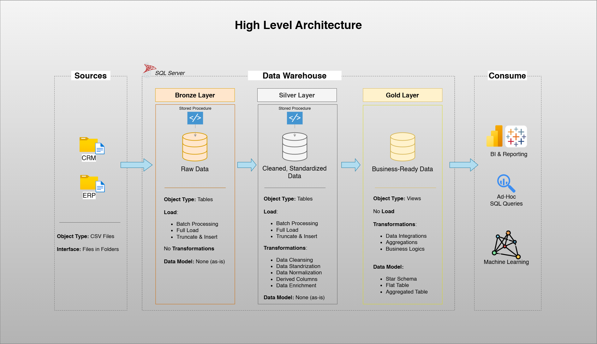

# Data Warehouse and Analytics Project

Welcome to the **Data Warehouse and Analytics Project** repository! 🚀  
This project demonstrates a comprehensive data warehousing and analytics solution, from building a data warehouse to generating actionable insights. Designed as a portfolio project.
---

## 🏗️ Data Architecture

The data architecture for this project follows the **Medallion Architecture** with Bronze, Silver, and Gold layers:



1. **Bronze Layer**: Stores raw data as-is from the source systems. Data is ingested from CSV files into SQL Server Database.  
2. **Silver Layer**: Includes data cleansing, standardization, and normalization processes to prepare data for analysis.  
3. **Gold Layer**: Houses business-ready data modeled into a **star schema** required for reporting and analytics.

---

## 📖 Project Overview

This project involves:

1. **Data Architecture**: Designing a modern data warehouse using the Medallion Architecture (Bronze, Silver, Gold).  
2. **ETL Pipelines**: Extracting, transforming, and loading data from source systems into the warehouse.  
3. **Data Modeling**: Developing fact and dimension tables optimized for analytical queries.  
4. **Analytics & Reporting**: Creating SQL-based reports and dashboards for actionable insights.

### 🔧 Key Skills Showcased:
- SQL Development  
- Data Architecture  
- ETL Pipeline Design  
- Data Modeling (Star Schema)  
- Data Analytics & Reporting  

---

## 🛠️ Tools & Technologies Used

- **SQL Server Express** – Relational database system  
- **SQL Server Management Studio (SSMS)** – SQL query and database management  
- **Git** – Version control  
- **DrawIO** – For data flow and architecture diagrams  
- **Notion** – Project planning and documentation  
- **CSV Files** – Source data (ERP and CRM)

---

## 🚀 Project Requirements

### 🧱 Building the Data Warehouse (Data Engineering)

**Objective:**  
Develop a modern data warehouse using SQL Server to consolidate sales data, enabling analytical reporting and informed decision-making.

**Specifications:**  
- Import data from two source systems (ERP and CRM) in CSV format.  
- Cleanse and resolve data quality issues.  
- Integrate both sources into a single analytical data model.  
- Focus on the most recent dataset (no historization).  
- Provide clear documentation to support stakeholders and analytics teams.

---

### 📊 BI & Reporting (Data Analysis)

**Objective:**  
Develop SQL-based analytics to deliver insights on:  
- Customer Behavior  
- Product Performance  
- Sales Trends  

---

## 📂 Repository Structure

```
data-warehouse-project/
│
├── datasets/                           # Raw datasets used for the project (ERP and CRM data)
│   ├── source_crm/                     
│   ├── source_erp/                     
│
├── docs/                               # Project documentation and architecture details
│   ├── etl.drawio                      # Draw.io file shows all different techniquies and methods of ETL
│   ├── data_architecture.drawio        # Draw.io file shows the project's architecture
│   ├── data_catalog.md                 # Catalog of datasets, including field descriptions and metadata
│   ├── data_flow.drawio                # Draw.io file for the data flow diagram
│   ├── data_models.drawio              # Draw.io file for data models (star schema)
│   ├── naming-conventions.md           # Consistent naming guidelines for tables, columns, and files
│
├── scripts/                            # SQL scripts for ETL and transformations
│   ├── bronze/                         # Scripts for extracting and loading raw data
│   ├── silver/                         # Scripts for cleaning and transforming data
│   ├── gold/                           # Scripts for creating analytical models
│
├── tests/                              # Test scripts and quality files
│
├── README.md                           # Project overview and instructions
├── .gitignore                          # Files and directories to be ignored by Git
```


---

## 📬 Contact

For collaboration or feedback, feel free to reach out via LinkedIn or GitHub issues.

---

## 🛡️ License

This project is licensed under the [MIT License](LICENSE). You are free to use, modify, and share this project with proper attribution.

